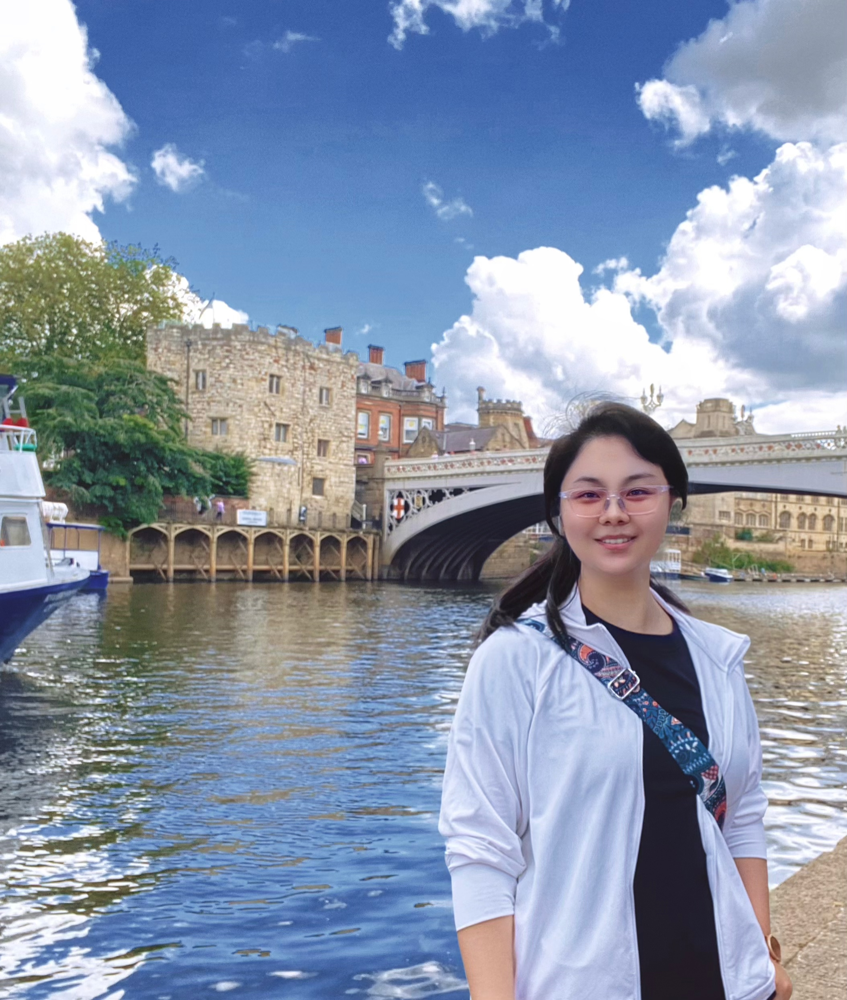

# About Me

Here is **Liman Wang (王莉漫)**.

I am currently pursuing a PhD in Intelligent Robotics at the [University of York](https://www.york.ac.uk/#/), UK, under the supervision of Professor [Jihong Zhu](https://jihong-zhu.github.io/).
I graduated with a Master's degree in Intelligent Robotics (first-class honor, with the first place in the class) from the University of York.
I worked as an Algorithm Engineer at [Schneider Electric Co., Ltd.](https://www.se.com/ww/en/#/), a Fortune Global 500 company, for 3 years.  
I love surfskating🛹!
If you are interested in any aspect of me, I would love to chat and collaborate.

---

## Research Interests

- Robotic Perception
- Dexterous Hand
- Large Language Models

---

## Reviewers

- IEEE Robotics and Automation Letters (RA-L), 2024
- IEEE International Conference on Robotics and Automation (ICRA), 2024
- IEEE International Conference on Multimedia & Expo (ICME), 2024
- IEEE/RSJ International Conference on Intelligent Robots and Systems (IROS), 2025

---

## News and Updates
- **April 2025: **Our work✨ *Balancing Rigor and Utility: Mitigating Cognitive Biases in Large Language Models for Multiple-Choice Questions* has been accepted as a full paper publication at [CogSci 2025](https://cognitivesciencesociety.org/cogsci-2025/) and will be presented as a poster. See you in San Francisco! [Proceedings paper download](https://www.computer.org/csdl/proceedings-article/icmew/2024/10645429/1ZNT7zHkzew)🔗
- **June 2024：**Pleased to receive the full scholarship for my PhD studies at the University of York.
- **April 2024：**Our work *LLM-SAP: Large Language Models Situational Awareness Based Planning* has been accepted to [ICME 2024 Workshop-MML4SG](https://vista-h.github.io/MML4SG_2024/#/) . See you in Canada! [Proceedings paper download](https://www.computer.org/csdl/proceedings-article/icmew/2024/10645429/1ZNT7zHkzew)🔗
- **March 2024：**Our work *FENet: Focusing Enhanced Network for Lane Detection* has been accepted to [ICME 2024](https://2024.ieeeicme.org/#/) as an Oral paper. See you in Canada! [Proceedings paper download](https://www.computer.org/csdl/proceedings-article/icme/2024/10687857/20F0GXZBkEU)🔗
- **Dec 2023：**Our work *Deformable Object Manipulation in Caregiving Scenarios: A Review* has been published on [MDPI Machines Journal](https://www.mdpi.com/2075-1702/11/11/1013#/) 🔗as a journal paper.
- **Nov 2023：**Earned the first-class honors degree (Distinction, GPA4.0) and secured first place in my major for the Master's degree in Intelligent Robotics at the University of York.
- **June 2023：**Pleased to have achieved 130% annual performance as an NLP algorithm engineer at Schneider Electric (China) Co., Ltd.
- **Jun 2022：**As an independent inventor, obtained a national invention patent on knowledge graphs and graph algorithms, issued by the [China National Intellectual Property Administration](https://www.cnipa.gov.cn/#/)🔗. 

 