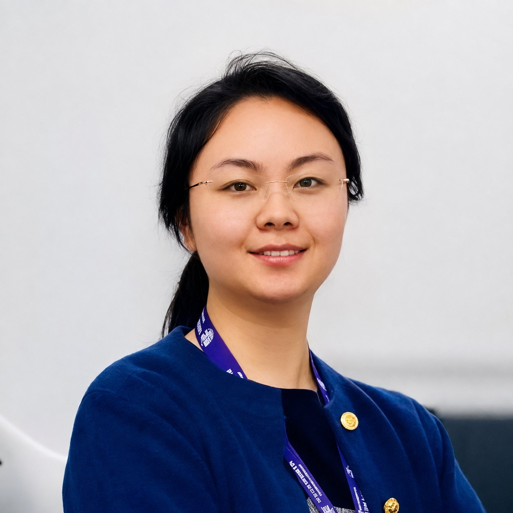

  

  

    <h1>Liman Wang (王莉漫)</h1>

    

      I am a PhD student in Intelligent Robotics at the
      <a href="https://www.york.ac.uk/#/">University of York</a>, UK, based at the
      <a href="https://www.york.ac.uk/safe-autonomy/">Institute for Safe Autonomy</a>,
      under the supervision of Dr.
      <a href="https://jihong-zhu.github.io/">Jihong Zhu</a>.
    

    

      My research focuses on <strong>robotic manipulation</strong>,
      <strong>dexterous hands and grippers</strong>, and
      <strong>multimodal AI for robotics</strong>.
    

    

      Before starting my PhD, I received my Master's degree in Intelligent Robotics
      from the University of York with <strong>Distinction</strong>, ranking
      <strong>first in my cohort</strong>. Previously, I worked as an Algorithm Engineer
      at <a href="https://www.se.com/ww/en/#/">Schneider Electric</a> for three years.
    

  

<section>
  <h2>Research Interests</h2>
  <ul class="interests">
    <li>Robotic Manipulation</li>
    <li>Dexterous Hands and Grippers</li>
    <li>Multimodal AI for Robotics</li>
  </ul>
</section>

<section>
  <h2>Selected Publications</h2>

  

    

      MLLM-Fabric: Multimodal Large Language Model-Driven Robotic Framework for Fabric Sorting and Selection
    

    
<strong>Liman Wang</strong>, et al.

    

      <em>IEEE Robotics and Automation Letters (RA-L), to be presented at IEEE International Conference on Robotics and Automation (ICRA), 2026</em>
    

    
<a href="https://arxiv.org/abs/2507.04351">Preprint</a>

  

  

    

      Balancing Rigor and Utility: Mitigating Cognitive Biases in Large Language Models for Multiple-Choice Questions
    

    
<strong>Liman Wang</strong>, et al.

    

      <em>Proceedings of the Annual Meeting of the Cognitive Science Society, 2025, Full Paper</em>
    

    
<a href="https://arxiv.org/abs/2406.10999">Preprint</a>

  

  

    

      LLM-SAP: Large Language Models Situational Awareness Based Planning
    

    
<strong>Liman Wang</strong>, et al.

    

      <em>IEEE International Conference on Multimedia &amp; Expo Workshops (ICMEW), Workshop on Multimodal Learning for Social Good, 2024</em>
    

    

      <a href="https://www.computer.org/csdl/proceedings-article/icmew/2024/10645429/1ZNT7zHkzew">Proceedings</a>
    

  

  

    

      FENet: Focusing Enhanced Network for Lane Detection
    

    
<strong>Liman Wang</strong>, et al.

    

      <em>IEEE International Conference on Multimedia &amp; Expo (ICME), 2024, Oral Presentation</em>
    

    

      <a href="https://www.computer.org/csdl/proceedings-article/icme/2024/10687857/20F0GXZBkEU">Proceedings</a>
    

  

  

    

      Deformable Object Manipulation in Caregiving Scenarios: A Review
    

    
<strong>Liman Wang</strong>, et al.

    

      <em>Machines, 2023, 11(11), 1013</em>
    

    

      <a href="https://www.mdpi.com/2075-1702/11/11/1013#/">Journal Paper</a>
    

  

</section>

<section>
  <h2>Reviewing Service</h2>
  <ul class="service-list">
    <li>IEEE Transactions on Automation Science and Engineering (T-ASE)</li>
    <li>Conference on Robot Learning (CoRL)</li>
    <li>IEEE International Conference on Robotics and Automation (ICRA)</li>
    <li>IEEE Robotics and Automation Letters (RA-L)</li>
    <li>IEEE/RSJ International Conference on Intelligent Robots and Systems (IROS)</li>
    <li>Artificial Intelligence Review (AIR)</li>
    <li>IEEE International Conference on Multimedia &amp; Expo (ICME)</li>
  </ul>
</section>

<section>
  <h2>News and Updates</h2>
  <ul class="news">
    <li>
      Oct 2025
      Our paper <em>MLLM-Fabric</em> has been accepted to <em>IEEE Robotics and Automation Letters (RA-L)</em> and will be presented at ICRA 2026.
      <a href="https://arxiv.org/abs/2507.04351">Preprint</a>
    </li>

    <li>
      Apr 2025
      Our work <em>Balancing Rigor and Utility</em> has been accepted as a full paper at
      <a href="https://cognitivesciencesociety.org/cogsci-2025/">CogSci 2025</a>.
      <a href="https://arxiv.org/abs/2406.10999">Preprint</a>
    </li>

    <li>
      Jun 2024
      I received a full scholarship for my PhD studies at the University of York.
    </li>

    <li>
      Apr 2024
      Our work <em>LLM-SAP</em> has been accepted to the
      <a href="https://vista-h.github.io/MML4SG_2024/#/">ICME 2024 Workshop on Multimodal Learning for Social Good</a>.
    </li>

    <li>
      Mar 2024
      Our work <em>FENet</em> has been accepted to
      <a href="https://2024.ieeeicme.org/#/">ICME 2024</a> as an oral paper.
    </li>

    <li>
      Dec 2023
      Our work <em>Deformable Object Manipulation in Caregiving Scenarios: A Review</em> was published in
      <a href="https://www.mdpi.com/2075-1702/11/11/1013#/">Machines</a>.
    </li>

    <li>
      Nov 2023
      I received my Master's degree in Intelligent Robotics from the University of York with Distinction, ranking first in my cohort.
    </li>

    <li>
      Jun 2023
      I achieved 130% annual performance as an NLP Algorithm Engineer at Schneider Electric (China) Co., Ltd.
    </li>

    <li>
      Jun 2022
      As an independent inventor, I obtained a national invention patent on knowledge graphs and graph algorithms, issued by the
      <a href="https://www.cnipa.gov.cn/#/">China National Intellectual Property Administration</a>.
    </li>
  </ul>
</section>

