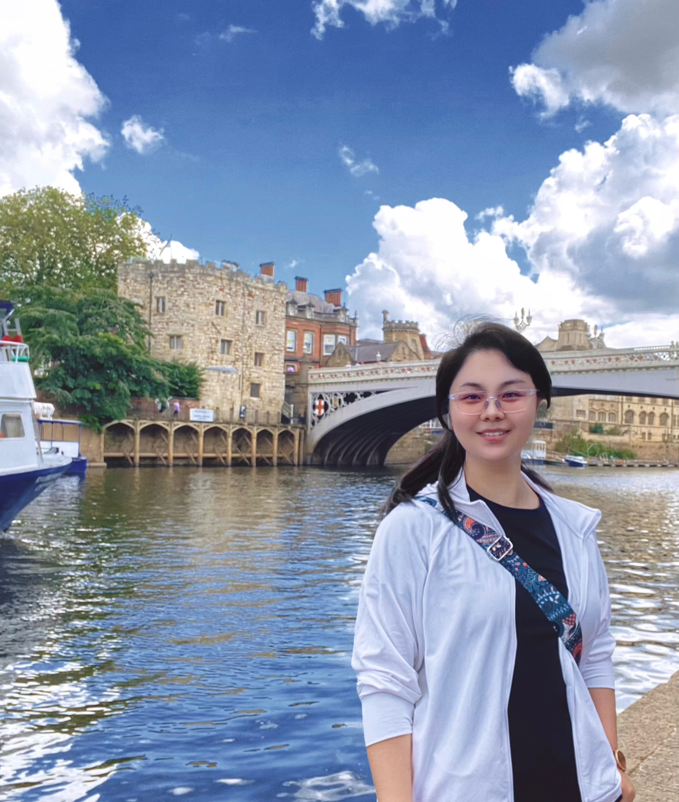

# About Me

Here is **Liman Wang (王莉漫)**.

I am a PhD student in Intelligent Robotics at the [University of York](https://www.york.ac.uk/#/), UK, based at the [Institute for Safe Autonomy](https://www.york.ac.uk/safe-autonomy/), under the supervision of Dr. [Jihong Zhu](https://jihong-zhu.github.io/).

My research focuses on **robotic manipulation**, **dexterous hands and grippers**, and **multimodal AI for robotics**.

Before starting my PhD, I received my Master's degree in Intelligent Robotics from the University of York with **Distinction**, ranking **first in my cohort**. Previously, I worked as an Algorithm Engineer at [Schneider Electric](https://www.se.com/ww/en/#/) for three years.

Outside research, I enjoy surfskating 🛹. I am always happy to chat about research ideas, collaboration opportunities, or anything interesting in robotics and AI.

---

## Research Interests

- Robotic Manipulation
- Dexterous Hands and Grippers
- Multimodal AI for Robotics

---

## Selected Publications

- **MLLM-Fabric: Multimodal Large Language Model-Driven Robotic Framework for Fabric Sorting and Selection**  
  **Liman Wang**, et al.  
  *IEEE Robotics and Automation Letters (RA-L), to be presented at IEEE International Conference on Robotics and Automation (ICRA), 2026*  
  [Preprint](https://arxiv.org/abs/2507.04351) 🔗

- **Balancing Rigor and Utility: Mitigating Cognitive Biases in Large Language Models for Multiple-Choice Questions**  
  **Liman Wang**, et al.  
  *Proceedings of the Annual Meeting of the Cognitive Science Society, 2025, Full Paper*  
  [Preprint](https://arxiv.org/abs/2406.10999) 🔗

- **LLM-SAP: Large Language Models Situational Awareness Based Planning**  
  **Liman Wang**, et al.  
  *IEEE International Conference on Multimedia & Expo Workshops (ICMEW), Workshop on Multimodal Learning for Social Good, 2024*  
  [Proceedings](https://www.computer.org/csdl/proceedings-article/icmew/2024/10645429/1ZNT7zHkzew) 🔗

- **FENet: Focusing Enhanced Network for Lane Detection**  
  **Liman Wang**, et al.  
  *IEEE International Conference on Multimedia & Expo (ICME), 2024, Oral Presentation*  
  [Proceedings](https://www.computer.org/csdl/proceedings-article/icme/2024/10687857/20F0GXZBkEU) 🔗

- **Deformable Object Manipulation in Caregiving Scenarios: A Review**  
  **Liman Wang**, et al.  
  *Machines, 2023, 11(11), 1013*  
  [Journal Paper](https://www.mdpi.com/2075-1702/11/11/1013#/) 🔗

---

## Reviewing Service

- Conference on Robot Learning (CoRL)
- IEEE International Conference on Robotics and Automation (ICRA)
- IEEE Robotics and Automation Letters (RA-L)
- IEEE/RSJ International Conference on Intelligent Robots and Systems (IROS)
- Artificial Intelligence Review (AIR)
- IEEE International Conference on Multimedia & Expo (ICME)

---

## News and Updates ✨

- **Oct 2025:** Our paper *MLLM-Fabric: Multimodal Large Language Model-Driven Robotic Framework for Fabric Sorting and Selection* has been accepted to *IEEE Robotics and Automation Letters (RA-L)* and will be presented at *ICRA 2026*. See you in Vienna, Austria! [Preprint](https://arxiv.org/abs/2507.04351) 🔗

- **April 2025:** Our work *Balancing Rigor and Utility: Mitigating Cognitive Biases in Large Language Models for Multiple-Choice Questions* has been accepted as a full paper at [CogSci 2025](https://cognitivesciencesociety.org/cogsci-2025/) and will be presented as a poster. See you in San Francisco! [Preprint](https://arxiv.org/abs/2406.10999) 🔗

- **June 2024:** I received a full scholarship for my PhD studies at the University of York.

- **April 2024:** Our work *LLM-SAP: Large Language Models Situational Awareness Based Planning* has been accepted to the [ICME 2024 Workshop on Multimodal Learning for Social Good](https://vista-h.github.io/MML4SG_2024/#/). See you in Canada! [Proceedings](https://www.computer.org/csdl/proceedings-article/icmew/2024/10645429/1ZNT7zHkzew) 🔗

- **March 2024:** Our work *FENet: Focusing Enhanced Network for Lane Detection* has been accepted to [ICME 2024](https://2024.ieeeicme.org/#/) as an oral paper. See you in Canada! [Proceedings](https://www.computer.org/csdl/proceedings-article/icme/2024/10687857/20F0GXZBkEU) 🔗

- **Dec 2023:** Our work *Deformable Object Manipulation in Caregiving Scenarios: A Review* has been published in [Machines](https://www.mdpi.com/2075-1702/11/11/1013#/) as a journal paper. 🔗

- **Nov 2023:** I received my Master's degree in Intelligent Robotics from the University of York with Distinction, ranking first in my cohort.

- **June 2023:** I achieved 130% annual performance as an NLP Algorithm Engineer at Schneider Electric (China) Co., Ltd.

- **June 2022:** As an independent inventor, I obtained a national invention patent on knowledge graphs and graph algorithms, issued by the [China National Intellectual Property Administration](https://www.cnipa.gov.cn/#/). 🔗
