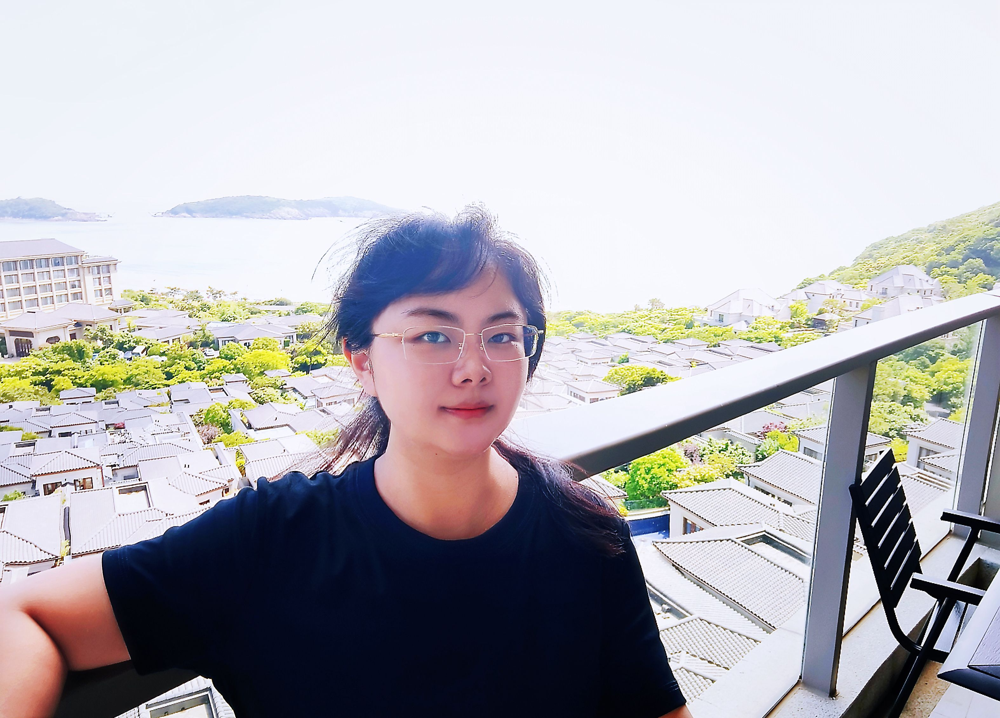

# About Me

Here is **Liman Wang (王莉漫)**.

I am a pre-PhD student in The University of York. I major in Artificial Intelligence and Robotics.
I graduated with a Master's degree in Intelligent Robotics with first-class honors from the University of York.
I worked as an NLP algorithm engineer at Schneider Electric (China) Co., Ltd., a Fortune Global 500 company, for 3 years.
If you are interested in any aspect of me, I would love to chat and collaborate, please email me at - *ssee02131@gmail.com*

## Academic Background

- **Sep 2024 - Future：**University of York (Incoming PhD, supervised by [Prof. Jihong Zhu](https://jihong-zhu.github.io/#/))
- **Sep 2022 - Sep 2023:** University of York (MSc, Intelligent Robotics)
- **Sep 2015 - June 2019:** Beijing International Studies University (B.M., BDA, Double Degree in English Majors)

---

## Research Interests

- Artificial Intelligence and Entrepreneurship.
- Large Language Models
-  Intelligent Robotics, Humanoid Robots
- Cutting-edge innovation
- My latest research findings(currently under review by EMNLP 2024): [Not All Bias is Bad: Balancing Rational Deviations and Cognitive Biases in Large Language Model Reasoning](https://arxiv.org/abs/2406.10999#/)🔗

---

## News and Updates

- **April 2024：**Our work *LLM-SAP: Large Language Models Situational Awareness Based Planning* has been accepted to [ICME2024 Workshop-MML4SG](https://vista-h.github.io/MML4SG_2024/#/) . See you in Canada! Preprint version:https://arxiv.org/abs/2312.16127#/🔗
- **March 2024：**Our work *FENet: Focusing Enhanced Network for Lane Detection* has been accepted to [ICME2024](https://2024.ieeeicme.org/#/) as an Oral paper. See you in Canada! Preprint version: https://arxiv.org/abs/2312.17163#/🔗
- **March 2024：**Happy to be nominated the CSC Scholarship.
- **Dec 2023：**Our work *Deformable Object Manipulation in Caregiving Scenarios: A Review* has been published on [MDPI Machines Journal](https://www.mdpi.com/2075-1702/11/11/1013#/) as a journal paper.
- **Nov 2023：**Earned the first-class honors degree (Distinction, GPA4.0) and secured first place in my major for the Master's degree in Intelligent Robotics at the University of York.
- **June 2023：**Pleased to have achieved 130% annual performance as an NLP algorithm engineer at Schneider Electric (China) Co., Ltd.
- **Jun 2022：**As an independent inventor, obtained a national invention patent on knowledge graphs and graph algorithms, issued by the [China National Intellectual Property Administration](https://www.cnipa.gov.cn/#/). Patent number:ZL202011014534.1

 